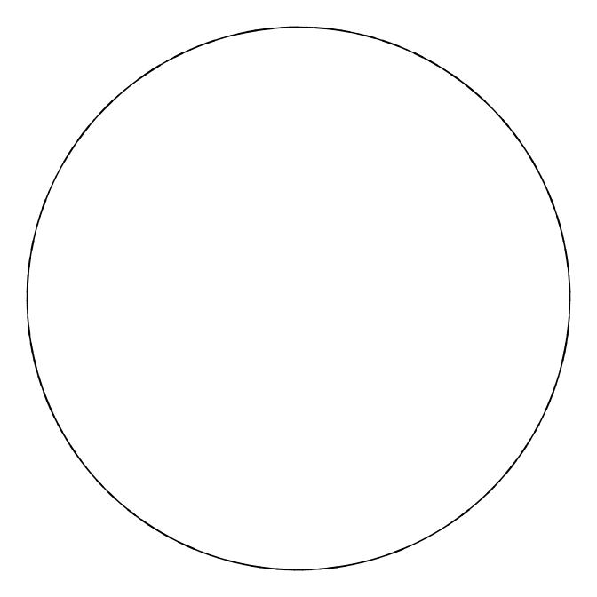
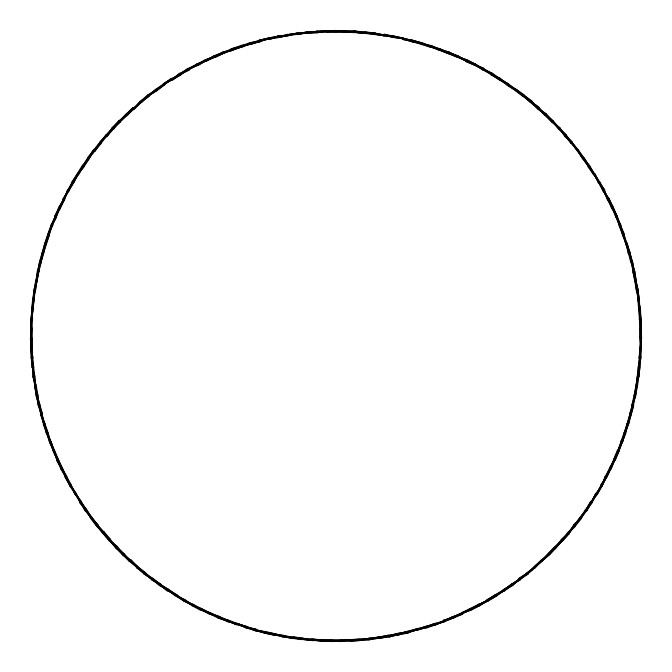
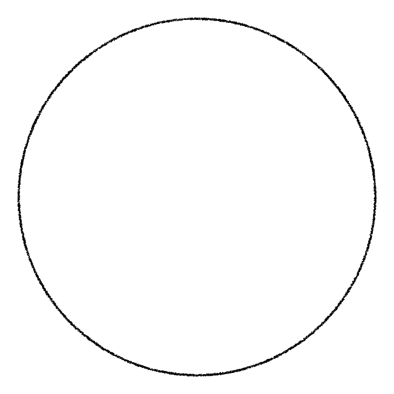

Draw Lines
================

``` r
source(here::here("functions.R"))
```

``` r
library(dplyr)
library(ggplot2)
```

``` r
tau = seq(0, 2*pi, length.out = 200)
x_init = sin(tau)
y_init = cos(tau)
```

## Type: Connect

``` r
circle_connect_df = draw_lines(x_seq = x_init,
                               y_seq = y_init,
                               type = "connect")

ggplot(data = circle_connect_df) +
  geom_segment(aes(x = x,
                   xend = xend,
                   y = y,
                   yend = yend,
                   size = size),
               lineend = "round",
               color = "black") +
  scale_size_identity() +
  coord_equal() +
  theme_void()
```



## Type: Adjacent

``` r
circle_adjacent_df = draw_lines(x_seq = x_init,
                               y_seq = y_init,
                               type = "adjacent")

ggplot(data = circle_adjacent_df) +
  geom_segment(aes(x = x,
                   xend = xend,
                   y = y,
                   yend = yend,
                   size = size),
               lineend = "round",
             color = "black") +
  scale_size_identity() +
  coord_equal() +
  theme_void()
```



## Type: Disperse

``` r
circle_point_df = draw_lines(x_seq = x_init,
                             y_seq = y_init,
                             type = "disperse")

ggplot(data = circle_point_df) +
  geom_point(aes(x = x,
                   y = y,
                   size = size),
             shape = 21,
             stroke = 0,
             fill = "black",
             color = "black") +
  scale_size_identity() +
  coord_equal() +
  theme_void()
```


